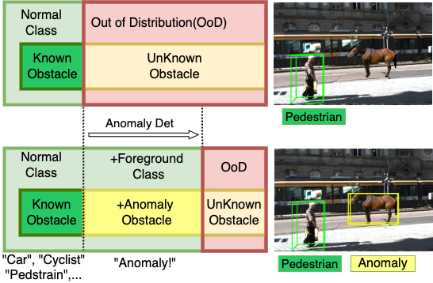

# S3AD
<center>

</center>

We release a **road-scene 3D anomaly object detection dataset** based on **augmented reality**.  
The dataset consists of two subsets:

- **Auxiliary Training Set**: contains multi-scale distributions composed of common object types.
- **OoD Evaluation Set**: composed of rare and unknown categories for out-of-distribution evaluation.

The ground truth annotations strictly follow the format of the **KITTI 3D Object Detection** dataset.

Details of the synthesis process and evaluation baselines can be found in our paper:  
**_Stereo-based 3D Anomaly Object Detection for Autonomous Driving: A New Dataset and Baseline_**.(Under Review)

paper link: http://arxiv.org/abs/2507.09214

dataset link: https://huggingface.co/datasets/shiyimu/KITTI-AR-OoD

If the data is inaccessible or if you have any questions, please contact me at shiyimu@shu.edu.cn

(如果数据无法访问，或任何疑问，可联系我邮箱：shiyimu@shu.edu.cn)

# Baseline
We release a simple multi-branch 3D anomaly detection baseline based on YOLOStereo3D for detecting the 3D locations of open-set objects.
<center>

</center>

# Install 

follow YOLOStereo3D(https://github.com/Owen-Liuyuxuan/visualDet3D)
```bash
pip3 install -r requirement.txt

# build ops (deform convs and iou3d), We will not install operations into the system environment
./make.sh
```

# Prepare Data 
```python
cd 07-A3D-For_paper_r1 
bash 1-det_precompute_ood.sh
# get train data of disparity (optional)
bash 2-disparity_percompute.sh
```
# Train
```bash
cd 07-A3D-For_paper_r1 
bash 3-07-811-ar-train-arood-val-arnums-10of10.sh
```
# Eval 
```bash
cd 07-A3D-For_paper_r1 
bash 3-07-811-eval-train-arood-val-arnums-10of10.sh
```

# Models and Results


Final model pth file: [Stereo3D_latest.pth](https://drive.google.com/file/d/11uyOnzvjhsy0nB2NfdC-Q51kADNV1S6-/view?usp=drive_link)


If you would like to make comparisons on other metrics, our inference results are as follows:

如果你想在其他指标下进行对比，我们的网络输出结果如下：

OoD detection results txts: [ood_result.zip](https://drive.google.com/file/d/1ty_yqcFF7oE7erAhWtrEIp6IMB2ZOlYB/view?usp=drive_link)


---
license: apache-2.0
---


